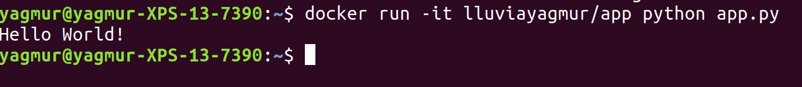

# dockerproj
This is a docker workflow to learn 

I build a containerized Python app from zero to learn Docker locally. I applied all the steps  from this tutorial [https://noahgift.github.io/cloud-data-analysis-at-scale/topics/docker-format-containers](https://noahgift.github.io/cloud-data-analysis-at-scale/topics/docker-format-containers)

 

To run python application using this docker image:

- docker pull lluviayagmur/app
- docker run -it lluviayagmur/app python app.py

 

